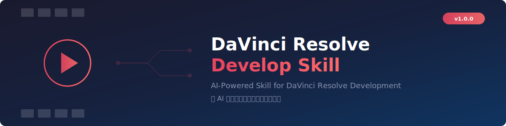
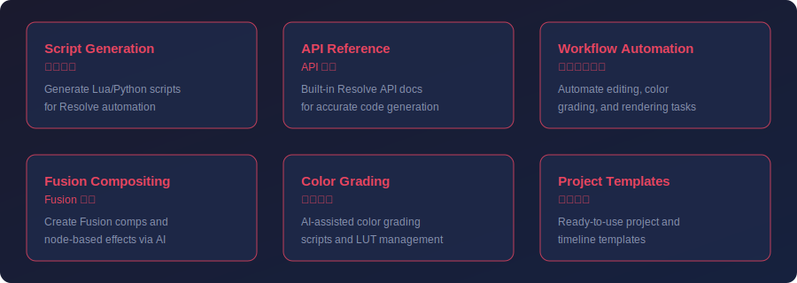

# DaVinci Resolve Develop Skill

An AI-powered skill that enables large language models to directly operate and develop scripts, plugins, and automated workflows for DaVinci Resolve.

**English** | [中文](README_CN.md) | [Changelog](CHANGELOG.md)

---

<div align="center">



</div>

---

## Features



### Core Features

- **Direct Resolve Control** - Operate DaVinci Resolve directly via inline Python code execution
- **Local API Reference** - Reads API docs from your local Resolve installation, always matching your installed version
- **Workflow Automation** - Automate editing, color grading, rendering, and delivery tasks

### Advanced Features

- **Fusion Compositing** - Create Fusion compositions and node-based effects via AI prompts
- **DCTL Color Effects** - Generate GPU-accelerated color transforms and effects
- **OpenFX / LUT / Fuse** - Develop plugins, lookup tables, and custom Fusion tools
- **Workflow Integration** - Build Electron or Python-based workflow plugins

---

## System Requirements

| Component | Minimum Version |
|-----------|----------------|
| DaVinci Resolve | 18.0+ |
| Python | 3.6+ |
| OS | Windows 10+ / macOS 11+ / Linux |

---

## Installation

### As a Claude Code Skill

Copy the skill directory to your Claude Code skills folder:

```bash
# Clone the repository
git clone https://github.com/Tonyhzk/davinci-resolve-develop-skill.git

# Copy to your Claude Code project
cp -r davinci-resolve-develop-skill/src/davinci-resolve-develop-skill/ your-project/.claude/skills/
```

---

## Quick Start

Once installed, the AI assistant can directly operate DaVinci Resolve:

- Execute Python code to control Resolve in real-time
- Generate automation scripts for timeline, media pool, and rendering
- Create Fusion compositions from text descriptions
- Develop DCTL effects, LUTs, OpenFX plugins, and Fuse tools

The skill reads API documentation directly from your local Resolve installation, ensuring accuracy with your installed version.

---

## Project Structure

```
src/davinci-resolve-develop-skill/
├── SKILL.md           # Skill definition and instructions
└── scripts/
    └── resolve_run.py # Execution entry point (auto-connects to Resolve)
```

---

## How It Works

The skill uses `resolve_run.py` to connect to your running DaVinci Resolve instance and execute Python code with pre-injected variables (`resolve`, `project`, `timeline`, `mediapool`, etc.).

API reference is read from your local Resolve installation directory, not bundled with the skill, so it always matches your installed version.

---

## Development Guide

### Prerequisites

- DaVinci Resolve (Free or Studio) - must be running
- Python 3.6+
- Claude Code CLI

### Contributing

Contributions are welcome! Please ensure:

1. Code passes all tests
2. Documentation is updated
3. Commit messages are clear and descriptive

---

## Acknowledgements

- [DaVinci Resolve](https://www.blackmagicdesign.com/products/davinciresolve) by Blackmagic Design
- [Claude Code](https://claude.com/claude-code) by Anthropic

## License

[Apache License 2.0](LICENSE)

## Author

**Tonyhzk**

- GitHub: [@Tonyhzk](https://github.com/Tonyhzk)
- Project: [davinci-resolve-develop-skill](https://github.com/Tonyhzk/davinci-resolve-develop-skill)

---

<div align="center">

If this project helps you, please give it a Star!

</div>
