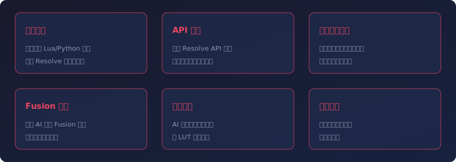

# DaVinci Resolve Develop Skill

为 AI 大模型打造的达芬奇开发技能，让 AI 能够开发 DaVinci Resolve 脚本、插件和自动化工作流。

[English](README.md) | **中文** | [更新日志](CHANGELOG_CN.md)

---

<div align="center">


</div>

---

## 功能特性



### 核心功能

- **脚本生成** - 自动生成 Lua 和 Python 脚本，实现 DaVinci Resolve 自动化操作
- **API 参考** - 内置 Resolve 脚本 API 文档，确保代码生成准确可靠
- **工作流自动化** - 自动化剪辑、调色、渲染和交付等常见任务

### 高级功能

- **Fusion 合成** - 通过 AI 提示创建 Fusion 合成和节点式视觉效果
- **调色辅助** - AI 辅助调色脚本生成和 LUT 管理工具
- **项目模板** - 开箱即用的项目和时间线模板

---

## 系统要求

| 组件 | 最低版本 |
|------|---------|
| DaVinci Resolve | 18.0+ |
| Python | 3.6+ |
| 操作系统 | Windows 10+ / macOS 11+ / Linux |

---

## 安装

### 作为 Claude Code Skill 安装

将 Skill 目录复制到 Claude Code 技能目录：

```bash
# 克隆仓库
git clone https://github.com/Tonyhzk/davinci-resolve-develop-skill.git

# 复制到项目中
cp -r davinci-resolve-develop-skill/src/davinci-resolve-develop-skill/ your-project/.claude/skills/
```

---

## 快速开始

安装后，AI 助手可以帮你完成以下达芬奇开发任务：

- 生成时间线操作的自动化脚本
- 通过文字描述创建 Fusion 合成
- 构建渲染管线自动化
- 通过代码管理媒体池和项目设置

---

## 项目结构

```
src/davinci-resolve-develop-skill/
├── SKILL.md           # Skill 定义和指令
├── docs/              # API 参考文档
│   ├── resolve-api/   # DaVinci Resolve 脚本 API
│   └── examples/      # 脚本示例和模板
└── scripts/           # 工具脚本
```

---

## 开发指南

### 环境要求

- DaVinci Resolve（免费版或 Studio 版）
- Python 3.6+
- Claude Code CLI

### 参与贡献

欢迎提交 Pull Request！提交前请确保：

1. 代码通过所有测试
2. 文档已更新
3. 提交信息清晰明了

---

## 致谢

- [DaVinci Resolve](https://www.blackmagicdesign.com/products/davinciresolve) - Blackmagic Design
- [Claude Code](https://claude.com/claude-code) - Anthropic

## 许可证

[Apache License 2.0](LICENSE)

## 作者

**Tonyhzk**

- GitHub: [@Tonyhzk](https://github.com/Tonyhzk)
- 项目地址: [davinci-resolve-develop-skill](https://github.com/Tonyhzk/davinci-resolve-develop-skill)

---

<div align="center">

如果这个项目对你有帮助，欢迎给个 Star！

</div>
